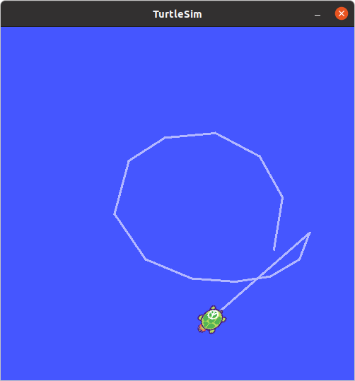
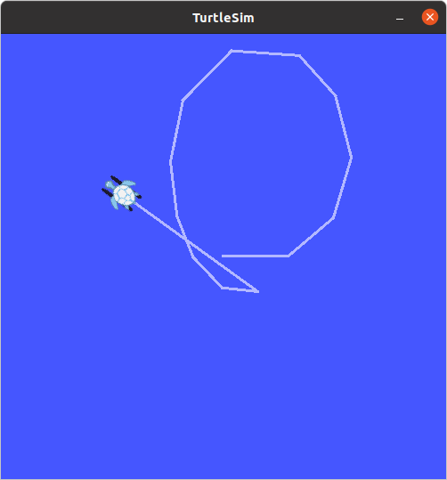

# Day 3 실습 결과

## rosbag record

<!-- 여기에 기록 중 거북이 경로 스크린샷을 넣으세요 -->
예시: 

## rosbag play
기록 내용 확인
```bash
eunjeong@ubuntu:~/bagfiles$ rosbag info my_turtle.bag 
path:        my_turtle.bag
version:     2.0
duration:    20.0s
start:       Mar 04 2026 23:36:26.56 (1772696186.56)
end:         Mar 04 2026 23:36:46.58 (1772696206.58)
size:        115.6 KB
messages:    1385
compression: none [1/1 chunks]
types:       geometry_msgs/Twist [9f195f881246fdfa2798d1d3eebca84a]
             turtlesim/Pose      [863b248d5016ca62ea2e895ae5265cf9]
topics:      /turtle1/pose     1252 msgs    : turtlesim/Pose     
             turtle1/cmd_vel    133 msgs    : geometry_msgs/Twist
```
<!-- 여기에 재생 결과 스크린샷을 넣으세요 -->
재생 명령어
```bash
rosbag play -r 1 my_turtle.bag 
```


## rosbag record


